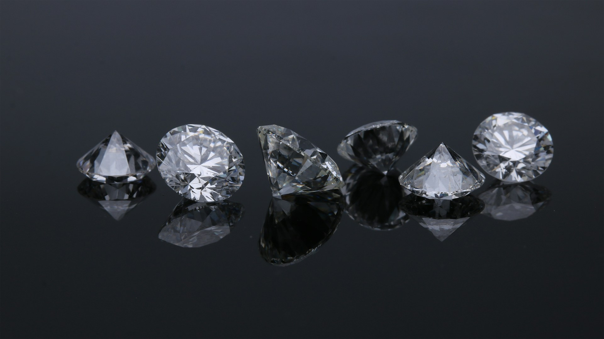

<div align="center">
  

# Diamonds Are Forever

</div>


---

### Setup guide

1. Clone repo

````bash
git clone https://github.com/maxmakovskiy/diamonds-are-forever.git
````

2. Build it

````bash
./mvnw dependency:go-offline clean compile package
````

3. Run compose

````bash
docker compose up -d
````

4. Verify that everything is running

````bash
docker compose ps
````

5. Run `curl` to test API point `/`

````bash
curl localhost:8080
````

Output should be:

````bash
Hello world
````

6. To stop running containers run

````bash
docker compose down
````

---

### Acknowledgements

Photo for logo has been taken from the work of [Edgar Soto](https://unsplash.com/@edgardo1987?utm_source=unsplash&utm_medium=referral&utm_content=creditCopyText) that is pusblished on [Unsplash](https://unsplash.com/photos/two-diamond-studded-silver-rings-gb0BZGae1Nk?utm_source=unsplash&utm_medium=referral&utm_content=creditCopyText).
